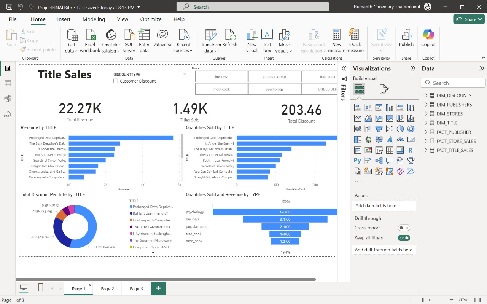
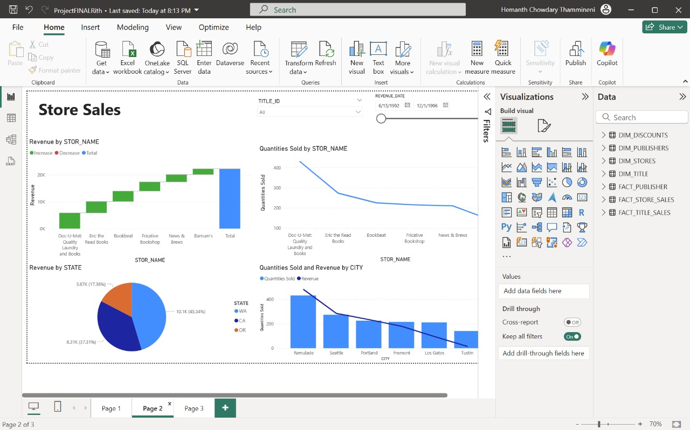
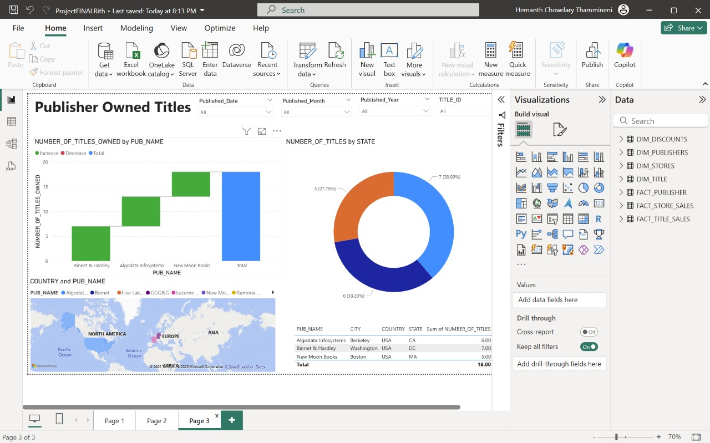

# Team-AirBall: Snowflake, DBT Cloud & Power BI Integration

## 📘 Project Title:
**"Data Warehousing and BI Reporting using Pubs Dataset"**

## 🧠 Overview

This project demonstrates the design and implementation of a modern cloud-based data warehouse using the classic **Pubs** dataset. We utilized **Snowflake** for scalable data warehousing, **dbt Cloud** for robust transformation workflows following the Kimball methodology, and **Power BI** for intuitive, drillable visual analytics.

## 👨‍💻 Team Members

- Austin Anthony Rodrigues  
- Hemanth Chowdary Thammineni  
- Likhith Kolli

## 🏗️ Tech Stack

- **Snowflake** – Cloud Data Warehousing  
- **DBT Cloud** – ELT Pipelines and Data Modeling  
- **Power BI** – Dashboarding and Business Intelligence  
- **Azure Data Studio & MinIO** – Initial Data Handling and Storage

---

## 📊 Dataset Description

The **Pubs** dataset simulates a publishing company, including entities like authors, titles, publishers, stores, and sales. It enables modeling various business processes, such as:

- Author contracts and royalty schedules
- Bookstore sales transactions
- Publisher ownership of titles
- Discounts and promotional schemes

**Core Tables:**
- `authors`, `titles`, `publishers`, `sales`, `stores`, `discounts`, `roysched`, `titleauthor`, `pub_info`, `employees`, `jobs`

---

## 🧱 Dimensional Modeling

### ✅ Business Processes Modeled:
1. **Title Sales** (`fact_sales`) – Revenue and quantity of each title sold  
2. **Store Sales** (`fact_store_sales`) – Daily sales per store per title  
3. **Publisher-Owned Titles** (`fact_publisher`) – Factless fact showing publisher-author-title relationships

### 📐 Dimension Tables:
- `dim_title` – Book-level metadata  
- `dim_store` – Store information  
- `dim_discount` – Discount schemes  
- `dim_publisher` – Publisher details

---

## ⚙️ ELT Workflow

1. **Data Staging**: Loaded raw data into Snowflake from Azure Data Studio & MinIO  
2. **Transformation**: dbt models created per business process, using SQL transformations  
3. **Data Modeling**: Bus Matrix applied using Kimball's dimensional design  
4. **BI Integration**: Final datasets loaded into Power BI for dashboarding

---

## 📈 Power BI Dashboards

Created interactive dashboards for each business process, including:

- Drill-across and drill-down capabilities
- Custom DAX hierarchies (e.g., publication date)
- User-friendly label updates (`title_id` → `title_name`)

---

## 🚧 Challenges Faced

- **Limited Data Volume**: Small row counts affected analysis depth
- **Date Parsing in Snowflake**: Resolved by casting to `VARCHAR` then converting via `TO_DATE`
- **Fact Table Design in DBT**: Refactored fact/dimension model after initial mismatches
- **Power BI Joins**: Fixed broken relationships during visualization by updating DBT models

---

## 🎓 Key Learnings

- Mastered **ELT pipelines** and **dbt workflows** for warehouse transformation
- Applied **Kimball's methodology** in real-world modeling
- Gained hands-on skills in **Snowflake schema design** and **Power BI drill features**
- Understood **integration issues** across cloud tools and how to resolve them collaboratively

---

## 🖼️ Sample Dashboards

Below are three sample dashboards we created in Power BI based on our data warehouse:

### 📘 Title Sales Dashboard
Shows total revenue, titles sold, and discount distribution by title and genre. Key insights include top-performing books and their revenue contribution.

### 🏪 Store Sales Dashboard
Displays revenue and sales performance by store, state, and city. It includes a waterfall chart for store-level contribution and a time-range filter for sales trends.

### 🏢 Publisher-Owned Titles Dashboard
Highlights the number of titles owned by each publisher, geographic spread, and publication trends. Includes map visual and donut chart by state.

